Core Public Policy Vocabulary
===========================

A- documentation: 

http://vmogi01.deri.ie/egovcppv/ 

B- use case example:

http://vmrtpa05.deri.ie:8080/dataset

C- publications:

[1] http://dl.acm.org/citation.cfm?id=3047366

[2] “Standardising Public Policy Documentation to Foster Collaboration Across Governmental Agencies” in press

D- Related Projects

https://github.com/mohadelrezk/cppv-ckan-implementation

https://github.com/mohadelrezk/GOV-DAF

Screen Samples
----------

UML
---

CKAN
——

Protege
----

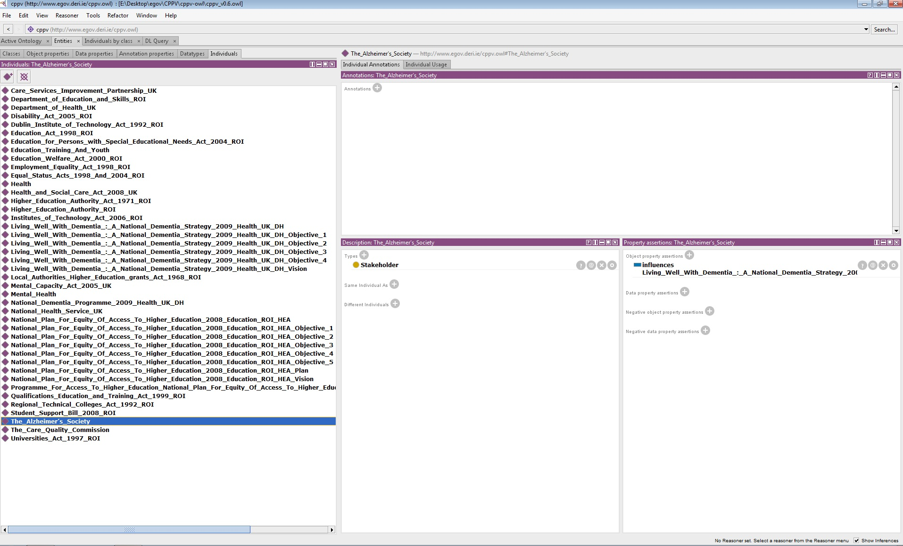

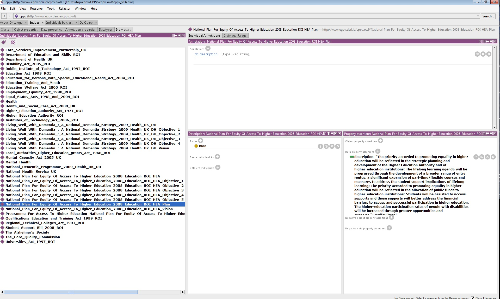

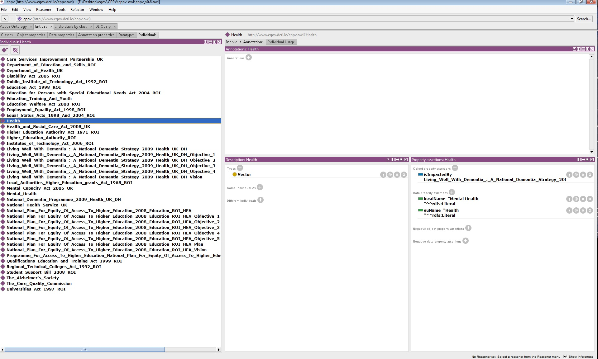

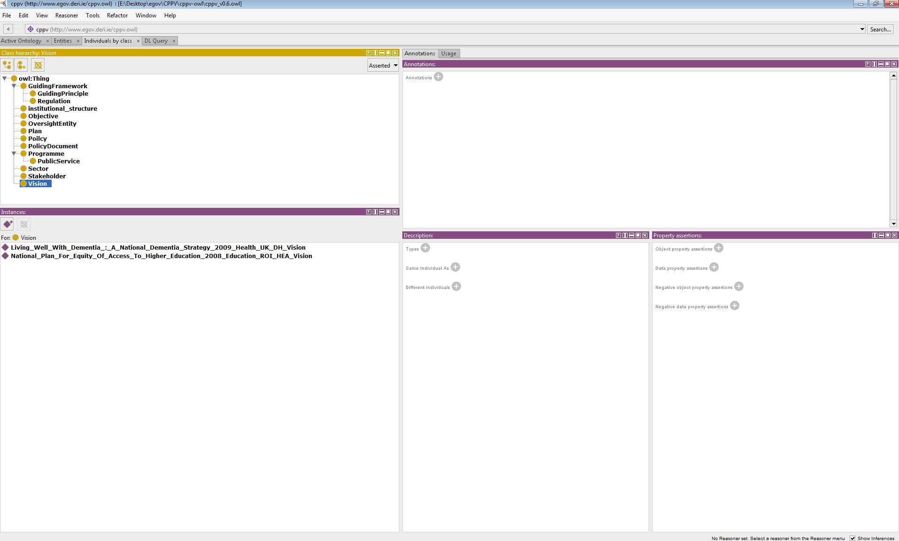

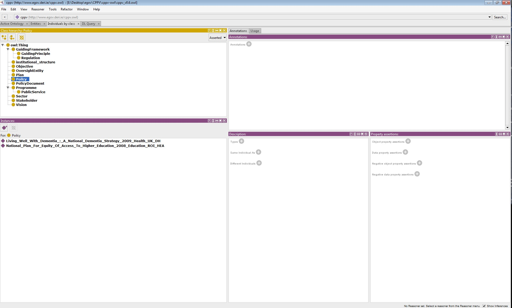

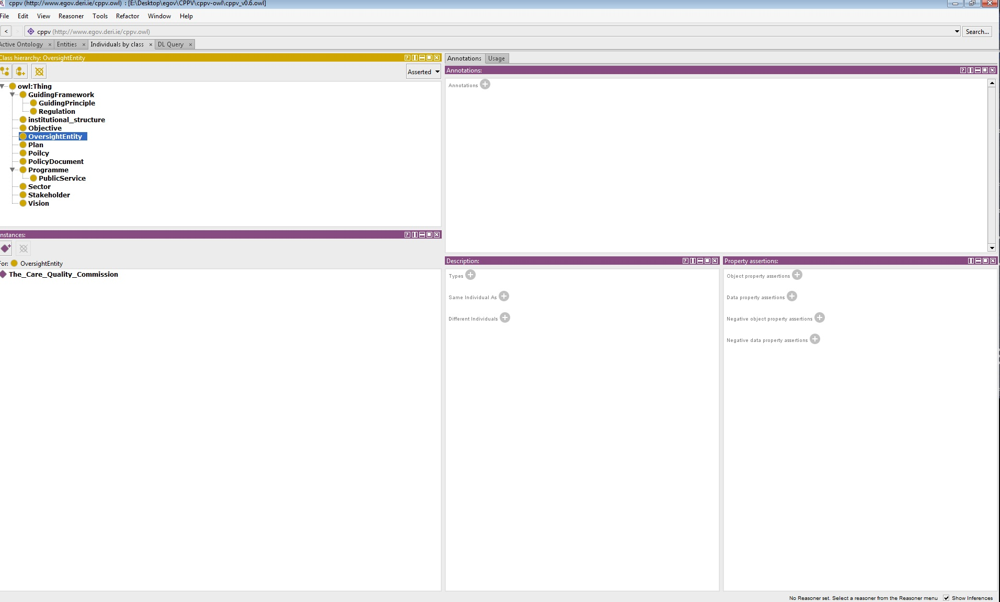

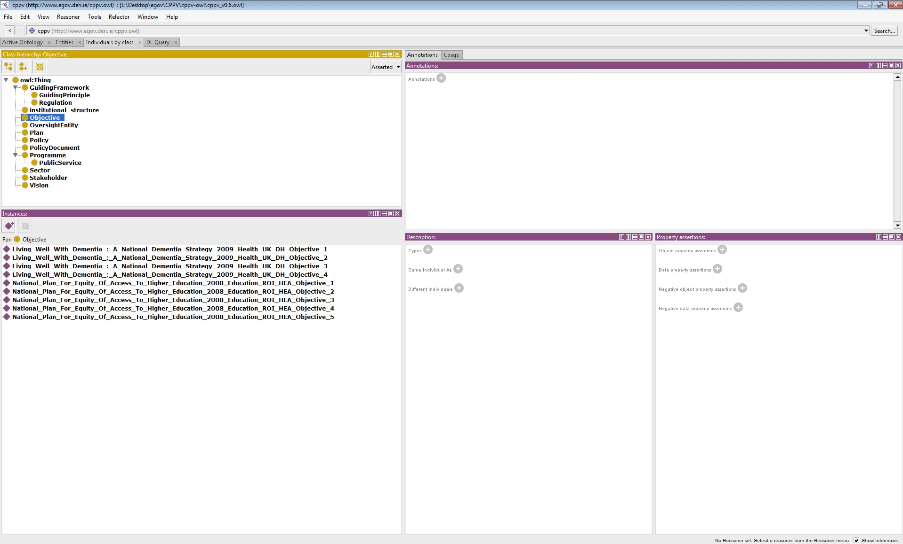

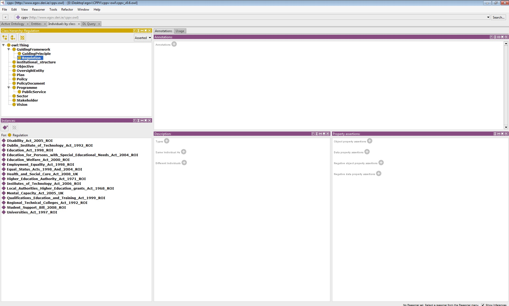

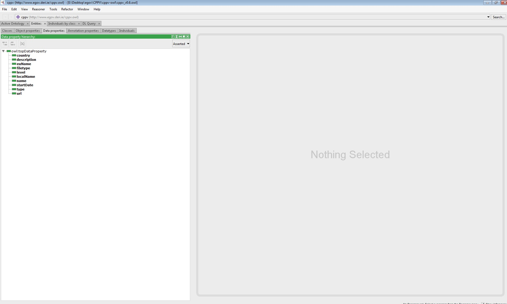

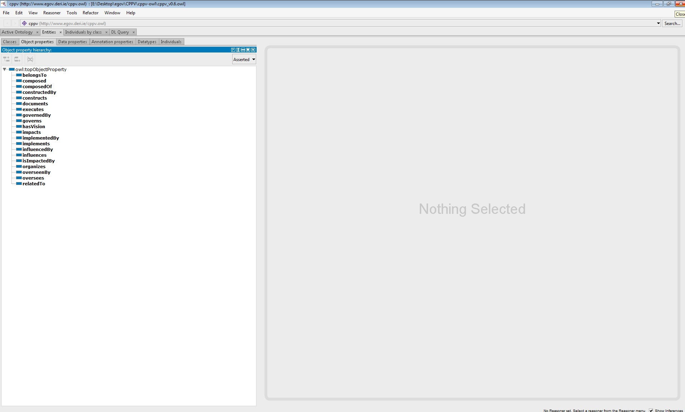

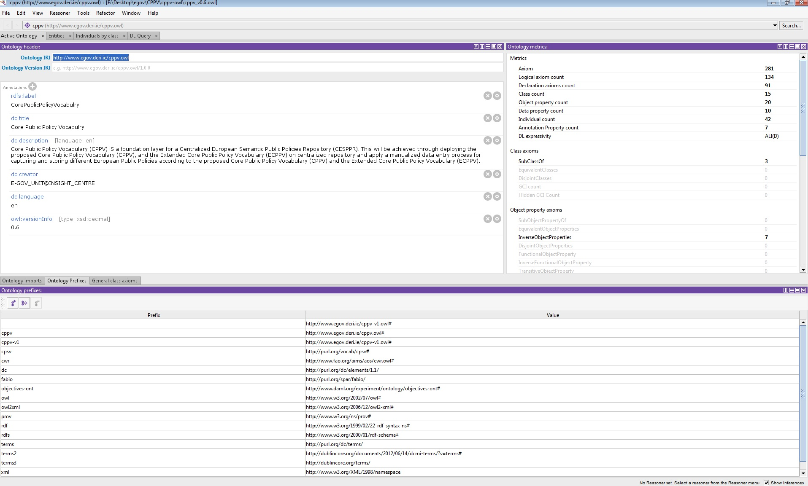

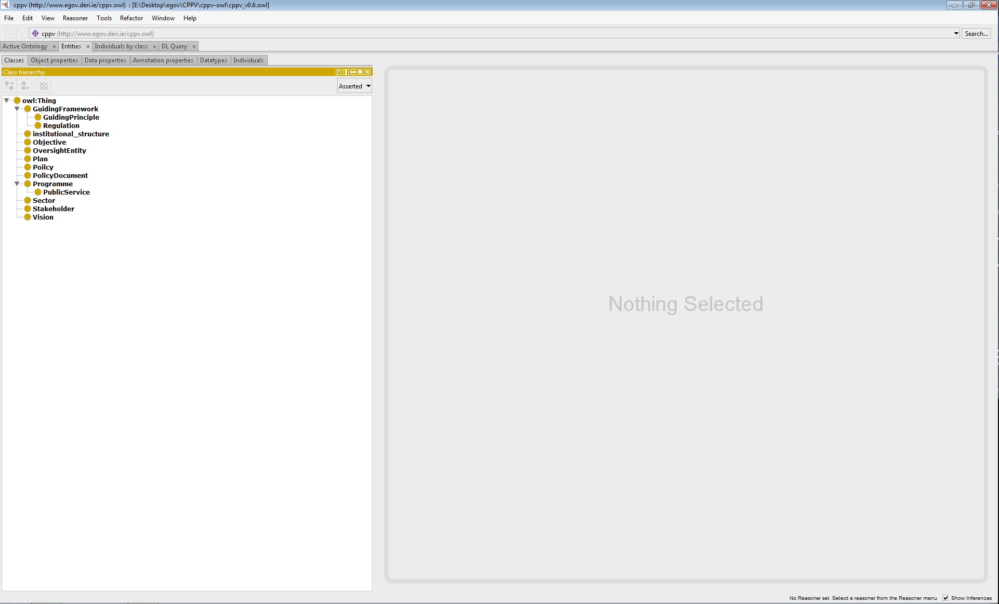

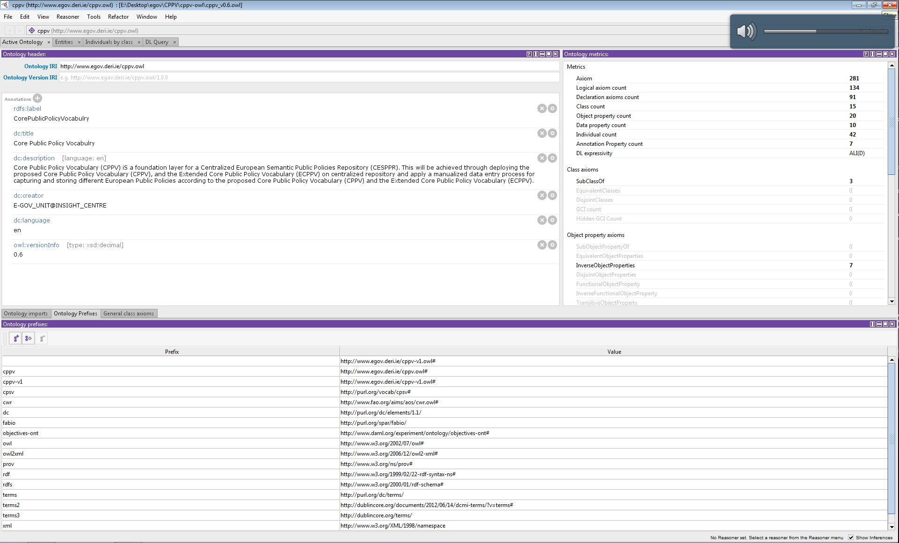

Last Update:
------------
19 August 2017

